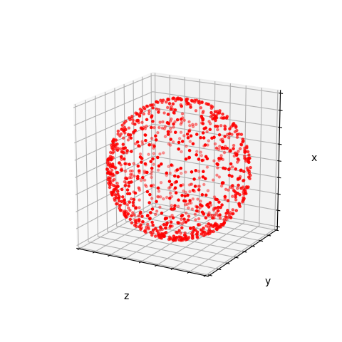

# RandomUniSphere
This is a short Python code that generates random uniform points on the surface of a sphere. 

It can be useful when performing Monte Carlo simulations, for example, simulating a uniformly emitting spherical surface.

Simply distributing points over spherical coordinates will result in an uneven distribution of points per unit area – with the greatest density of points at the poles, and sparsest at the equator. Thus, our aim is to achieve a constant density of points in a differential unit area on the sphere.

To do this, theta should follow a probability density function (pdf) of sine, and phi, a uniform distribution. We use the convention in which theta varies from 0 to pi and phi, 0 to 2 pi. The cumulative density functions (cdf) of the coordinate theta is 1/2(1-cos theta).

Using the inverse transform sampling method, the theta coordinates are found to be acos(1-2u), where u is a random number from 0 to 1. Phi coodinates are (2pi u).

These spherical coordinates are then converted to the cartesian system and plotted in a 3d projection. The output is such:

The number of points (N) can be varied.
